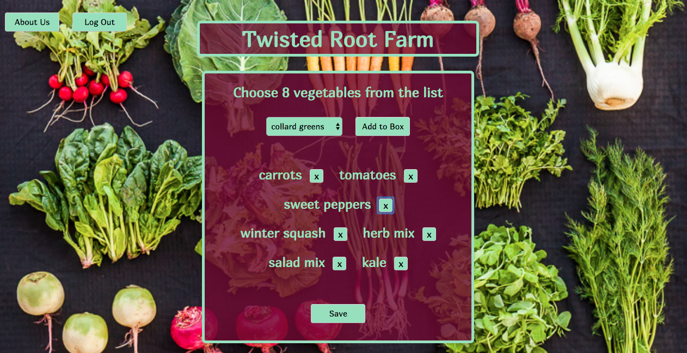

This project was bootstrapped with [Create React App](https://github.com/facebookincubator/create-react-app).
 and 
 - Redux
 - Node.js/Express
 - MongoDB/Mongoose
 - Enzyme/Jest
 - JWT/bcryptjs/passport

The CSA box builder is an app to enable a farm business to provide their customers with the opportunity to set preferences for each of their weekly shares.  CSA stands for Community Supported Agriculture and is a way for cusotmers to provide the farmer with her preseason start up costs.  In exchange for their investment, the customer gets a weekly share of the farm's produce.  This app allows the customer to select what vegetables they would like to recieve each week.

See the app here:

Use username 'demo' and password 'password88' to login.

https://csa-box-builder.herokuapp.com/

Code architecture: 

The App component is the root component for this app.  Front-end authenitcation is handled in the RegistrationPage and LandigPage components.  The Dashboard component handles the date selection and the BoxPage handles the individual vegetable selection.

Backend authentication is handled by with the auth/strategies through the user and auth routers.  There are two collections in the database.  The vegetable collection is controlled by the admin and is not accessible to the user. It contains all the vegetable options available to the customer. The box collection contains saved box information for each user. 

Frontend tests are run with Enzyme.  Each component has a corresponding test file. 

