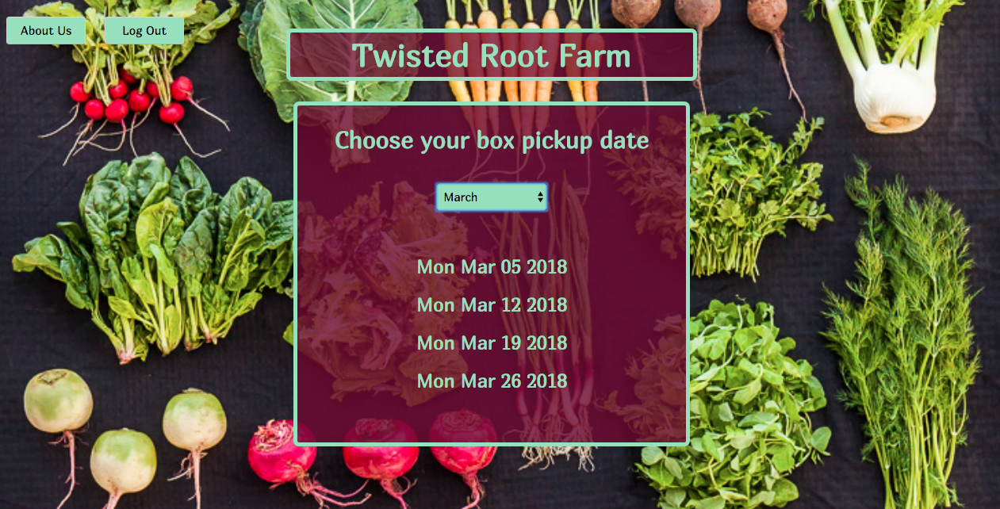
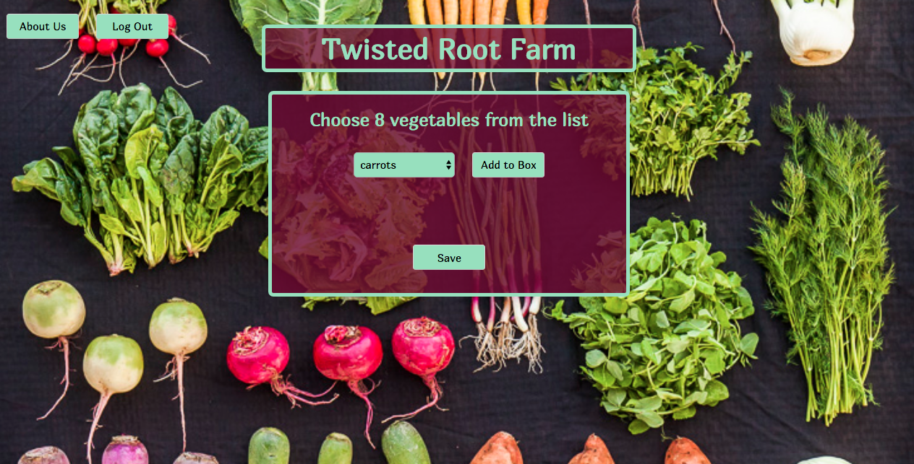

This project was bootstrapped with [Create React App](https://github.com/facebookincubator/create-react-app).

The CSA box builder app is an app for a farm business to use to enable their customers to set preferences for each of their weekly shares.  CSA stands for Community Supported Agriculture and is a way for cusotmers to help provide the farmer with his preseason start up costs.  In exchange for their investment, the customer get a weekly share of the farm's produce.  This app allows the customer to select what vegetables they would like to recieve each week.

The app can be viewed here:

https://csa-box-builder.herokuapp.com/

